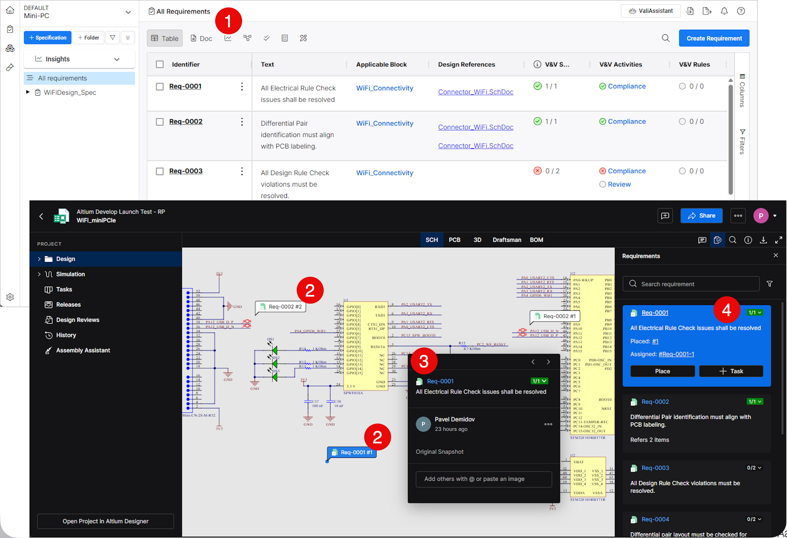
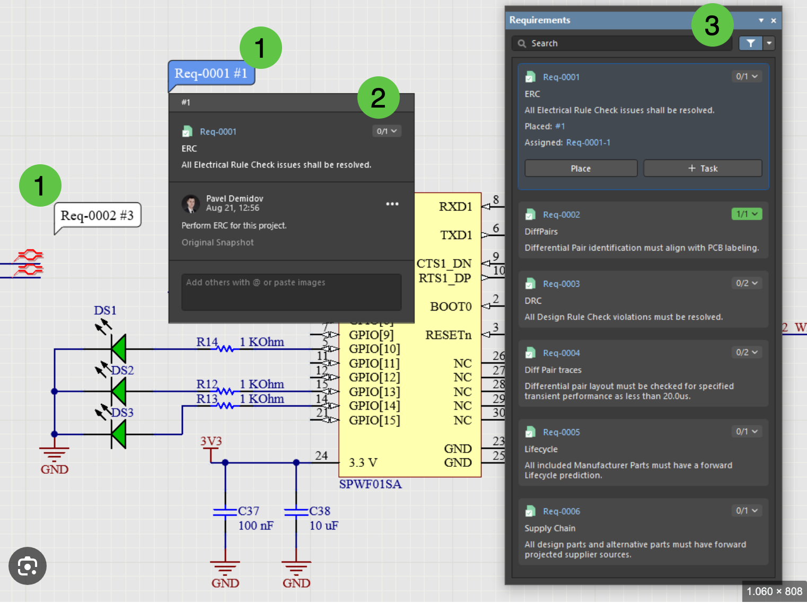

# Proposal: StrictDoc–KiCad Integration

**Bidirectional Requirements Management, Native Traceability, and Continuous Validation**

Author: Steve Lazzeri
Version: 1.0 Draft
Date: July 27, 2026

## 1. Introduction

Requirements engineering is widely used in software and safety-critical industries to improve traceability, verification, and overall project quality. This proposal explores how StrictDoc and KiCad can be integrated to provide an open, community-driven solution for hardware requirements management, bidirectional traceability, and continuous validation throughout the hardware development lifecycle.

## 2. Executive Summary

This document defines the desired outcomes for integrating StrictDoc and KiCad throughout the hardware development lifecycle. It establishes a shared vision and presents an incremental implementation roadmap.

The objective is to establish a common framework for hardware requirements engineering that enables engineers to manage requirements alongside hardware design, maintain end-to-end traceability, and automate verification throughout the development lifecycle.

The proposed implementation is organized into three phases:

1. **Plugin (Minimum Viable Product)** – Validate engineering workflows and bidirectional synchronization while gathering early community feedback.
2. **CI/CD (Minimum Viable Product)** – Introduce automated validation, traceability verification, and engineering reporting.
3. **Native KiCad Integration** – Investigate long-term native support for requirements management, traceability, and validation within KiCad.

## 3. Vision

StrictDoc remains the authoritative source for requirements, while KiCad becomes the engineering environment where requirements are implemented, reviewed, verified, and maintained.

The integration aims to make requirements first-class engineering objects that can be associated with hardware design elements, reviewed, verified, and traced throughout the entire hardware development lifecycle.

> **Important**
>
> This proposal introduces `.kicad_req`, a new project metadata file that stores synchronized requirements, versions, and traceability information independently of KiCad design files. It enables offline use, change detection, and synchronization with StrictDoc.

The integration should support:

- Block diagrams
- Schematic symbols
- PCB objects and nets
- Design rules
- Verification activities
- Automated CI/CD validation

The following images and screenshots from Altium are provided as examples to illustrate the proposed requirements management and traceability workflow.

## 4. Expected Capabilities

The proposed integration should provide the following core engineering capabilities:

**Requirements Engineering**

- Import and synchronize requirements between StrictDoc and KiCad.
- Manage and browse requirements within KiCad.
- Maintain requirement hierarchies and properties.

**Traceability**

- Allocate requirements to hardware design elements.
- Support bidirectional navigation between requirements and hardware objects.
- Display implementation and verification status.

**Verification & Validation**

- Validate requirement synchronization and project consistency.
- Detect broken references, missing implementations, and missing verification activities.
- Identify duplicate requirement IDs and orphaned design objects.

**Reporting**

- Generate traceability reports.
- Generate verification and coverage reports.
- Generate CI/CD validation summaries.

## 5. Open Source Collaboration

The proposed integration should be developed as an open-source project under the MIT License, with design discussions, implementation, issue tracking, and documentation taking place in public repositories.

The success of this initiative depends on collaboration between the StrictDoc and KiCad communities. Developers, maintainers, and users are encouraged to work together to define the architecture, refine engineering workflows, and guide the project's long-term evolution.

Contributions of all kinds are welcome. Community members are encouraged to contribute through:

- Design discussions, technical proposals, and code contributions.
- Testing, documentation, bug reports, and feature requests.
- Code reviews, user feedback, mentoring, and community outreach.

By fostering an open, inclusive, and collaborative development process, this project can become a robust, maintainable, and extensible foundation for hardware requirements engineering within the KiCad ecosystem.

## 6. Roadmap

**Phase 1 – Plugin (Minimum Viable Product)**

Develop a prototype to validate engineering workflows without requiring modifications to the KiCad core.

- Prototype requirements synchronization between StrictDoc and KiCad.
- Validate core engineering workflows and traceability.
- Gather community feedback to guide future development.

**Phase 2 – CI/CD (Minimum Viable Product)**

Extend the plugin with automated validation and traceability verification.

- Automate requirement and project validation.
- Verify end-to-end traceability throughout the design lifecycle.
- Generate engineering and CI/CD validation reports.

**Phase 3 – Native KiCad Integration**

Investigate long-term native support for requirements engineering within KiCad.

- Integrate native requirements management and traceability.
- Provide public APIs for extensions and automation.
- Deliver an enhanced, fully integrated user experience.

## 7. Example Use Cases

**Example 1: Requirement Allocation**

A hardware engineer imports project requirements from StrictDoc into KiCad. Requirement REQ-PWR-001 is allocated to the power supply block diagram and linked to the regulator schematic symbol, PCB footprint, power net, and associated design rule.

Selecting any linked object displays the requirement properties, implementation status, verification information, and a direct link to the corresponding requirement in StrictDoc. This enables engineers to quickly understand where a requirement is implemented and verify its traceability throughout the hardware design.

**Example 2: Requirement Change and Validation**

A system engineer updates REQ-PWR-001 in StrictDoc. The synchronization engine propagates the changes to the KiCad project and highlights all affected design objects for review.

Before the design is released, the CI/CD pipeline automatically validates the project, including StrictDoc documents, requirement synchronization, traceability, project integrity, ERC, and DRC, and generates a comprehensive validation report.

## 8. Technical Investigation

The technical investigation should evaluate the feasibility of integrating StrictDoc and KiCad, with particular attention to:

- Plugin architecture and extensibility.
- Native KiCad APIs and integration points.
- Requirements synchronization and the underlying data model.
- User interface design and engineering workflows.
- Performance, scalability, and long-term maintainability.
- Compatibility with future KiCad releases.

## 9. Success Criteria

The proposed integration will be considered successful if it achieves the following objectives:

**Functional**

- Synchronize requirements between StrictDoc and KiCad.
- Support bidirectional navigation between requirements and hardware objects.
- Enable requirement allocation throughout the hardware design.

**Verification**

- Provide automated validation and traceability verification.
- Integrate with CI/CD workflows.
- Generate comprehensive traceability and validation reports.

**Quality**

- Scale to support large and complex hardware projects.
- Maintain a modular, extensible, and maintainable architecture.

## 10. Next Steps

The next phase of this initiative is to engage the StrictDoc and KiCad communities and refine the proposed architecture and implementation roadmap.

The initial activities are to:

1. Review and refine this proposal.
2. Publish the proposal for community discussion.
3. Engage with the KiCad maintainers and the StrictDoc community.
4. Review the proposed engineering workflows and architecture.
5. Evaluate candidate implementation approaches.
6. Estimate the development effort.
7. Define the scope of the Plugin (Minimum Viable Product).
8. Establish milestones and begin development of the Plugin MVP.

## 11. Conclusion

This proposal presents an incremental approach to integrating StrictDoc and KiCad for hardware requirements engineering, bidirectional traceability, and continuous validation.

By starting with a lightweight plugin and progressively evolving toward native KiCad integration, the project can validate concepts early, encourage community collaboration, and establish a robust, extensible, and sustainable foundation for requirements-aware hardware design within the KiCad ecosystem.
